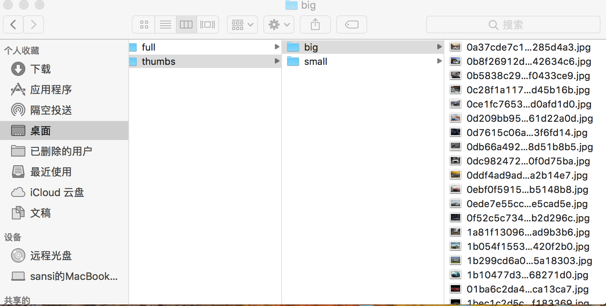
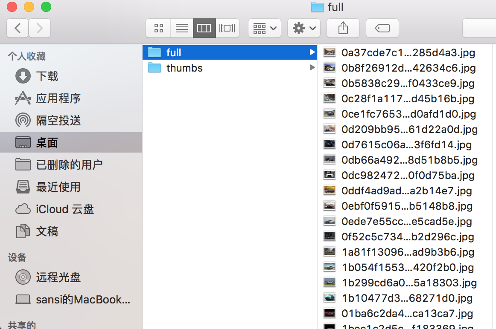

### 爬取某个车站的图片

#### item.py 中

1、申明item 的fields

     class PhotoItem(scrapy.Item):
          # define the fields for your item here like:
          # name = scrapy.Field()
          image_urls = scrapy.Field()
          images = scrapy.Field()
          pass

#### spider 的image.py
1. 导入头文件

        from Photo.items import PhotoItem

        from scrapy import Spider

        from scrapy import Selector

        from scrapy.http import Request
        
2. 爬取代码

注：
只需要爬取图片对应的url

翻页爬取时加上爬取范围url

    class imageSpider(Spider):
          name = 'car'
          allowed_domains = ['car.autohome.com.cn']
          start_urls = [
              "https://car.autohome.com.cn/jingxuan/list-0-p1.html",
          ]
          
    def parse(self, response):
        item = PhotoItem()
        sel = Selector(response)
        item['image_urls'] = sel.xpath('//ul[@class="content"]/li/a/img/@src').extract()

        print item['image_urls'], '..image_urls..'
        yield item

        # 翻页
        new_urls = response.xpath('//div[@class="pageindex"]/a[9]/@href').extract_first()

        new_url = "https://car.autohome.com.cn" + new_urls

        print new_url, '..new_url...'
        if new_url:

           yield Request(new_url, callback=self.parse)        
           
#### settings.py 中

###### Configure item pipelines

    ITEM_PIPELINES = {
        'Photo.pipelines.jandanPipeline': 200,
        # 'Photo.pipelines.PhotoPipeline': 300,
     }

##### 存储下载图片所在位置

      IMAGES_STORE = '/Users/sansi/Desktop/Scrapy/Photo/Image'
      DOWNLOAD_DELAY = 0.25

##### 缩略图大小
      IMAGES_THUMBS = {
         'small': (50, 50),
         'big': (200, 200),
      }
##### 图片的失效期限
       IMAGES_EXPIRES = 90           
           
   
#### pipelines.py 中

1. 导入头文件

        import os
        import urllib
        import scrapy
        from scrapy.exceptions import DropItem
        from scrapy.pipelines.images import ImagesPipeline
        from Photo import settings        
           
2. 编写爬取下载
<pre>
class PhotoPipeline(object):
    def process_item(self, item, spider):
        return item
        </pre>

##### 重写ImagesPipeline，对各个url返回Request

<pre>
class jandanPipeline(ImagesPipeline):
    def get_media_requests(self, item, info):
        for image_url in item['image_urls']:
            yield scrapy.Request(image_url)

</pre>

##### 当一个项目所有的请求完成时调用

    def item_completed(self, results, item, info):
        image_paths = [x['path'] for ok, x in results if ok]
        if not image_paths:
            raise DropItem("Item contains no images")
        item['images'] = image_paths
        return item          
           
           
           
           